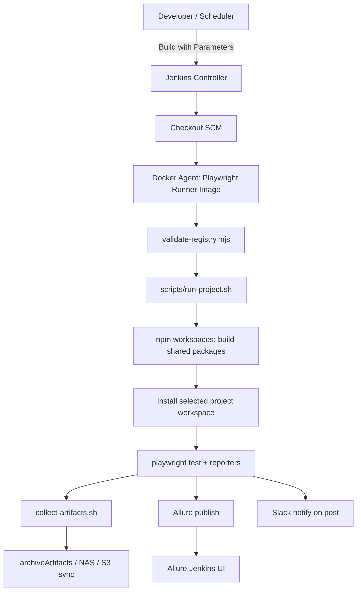

# QA Automation Hub (Playwright + TypeScript + Jenkins + Docker)

Centralized, **enterprise-style** monorepo for **many** Playwright projects with **shared framework code**, **dynamic selection** (project/env/browser/tags/headed), **Allure**, **artifacts per project**, and **Jenkins** orchestration running in **Docker**.

This repository is a **starter scaffold** you can copy/adapt. It is **FOSS-first** (Playwright, Jenkins, Allure, Slack webhooks).

## Phantasm desktop layout (this workspace)

Your machine layout is:

```text
Phantasm/
├── qa-automation-hub/          # hub (registry, Jenkinsfile, Docker, scripts)
├── Amipro-Simpor-B2C/          # sibling Playwright project
├── Elitekem/
├── ... (other sibling suites)
```

`tooling/projects.registry.json` uses **`repoPath`** relative to the **Phantasm root** (the folder that contains `qa-automation-hub` and all sibling suites). CI sets:

- **`PHANTASM_MONO_ROOT`**: absolute path to that Phantasm root (defaults to the parent directory of `qa-automation-hub` when you run scripts locally).

**GitHub Actions**: workflow lives at `Phantasm/.github/workflows/qa-automation-matrix.yml` and expects the **entire `Phantasm` folder** to be the repository root pushed to GitHub.

**Jenkins**: point the job’s SCM checkout at the same **Phantasm mono root** (not only `qa-automation-hub`), so sibling folders exist in the workspace during the build.

---

## Table of contents

1. [Enterprise folder structure](#1-enterprise-folder-structure)
2. [Monorepo architecture](#2-monorepo-architecture)
3. [Jenkins pipeline setup](#3-jenkins-pipeline-setup)
4. [Docker architecture](#4-docker-architecture)
5. [Dockerfile(s)](#5-dockerfiles)
6. [docker-compose.yml](#6-docker-composeyml)
7. [Jenkinsfile](#7-jenkinsfile)
8. [Shared framework architecture](#8-shared-framework-architecture)
9. [Shared utility structure](#9-shared-utility-structure)
10. [Playwright base framework structure](#10-playwright-base-framework-structure)
11. [Example project structure](#11-example-project-structure)
12. [Dynamic project execution script](#12-dynamic-project-execution-script)
13. [Reporting architecture](#13-reporting-architecture)
14. [Best practices](#14-best-practices)
15. [Environment management](#15-environment-management)
16. [Execution flow diagram](#16-execution-flow-diagram)
17. [Scalability recommendations](#17-scalability-recommendations)
18. [Naming conventions](#18-naming-conventions)
19. [Logging strategy](#19-logging-strategy)
20. [Failure handling strategy](#20-failure-handling-strategy)

Plus: [Implementation steps](#implementation-steps-beginner-friendly), [Parallel execution](#parallel-execution), [Dynamic Jenkins parameters](#dynamic-jenkins-parameters-enterprise-pattern), [Slack](#slack-notifications), [Gmail / email](#gmail--smtp-email-notifications), [Volumes](#docker-volume-strategy), [Future dashboard ideas](#future-dashboard-architecture-ideas), [Common mistakes](#common-mistakes-to-avoid), [Scaling to 50+ projects](#scaling-to-50-projects).

---

## Quick start (local developer)

```powershell
cd qa-automation-hub
npm install
npm run build:shared
cd projects/example-acme-ui
npx playwright install
npm test
```

Linux/WSL “hub runner” (matches Jenkins behavior):

```bash
cd qa-automation-hub
export PHANTASM_MONO_ROOT="$(cd .. && pwd)"
export PROJECT_ID=example-acme-ui
export ENVIRONMENT=staging
export BROWSER=chromium
export TAGS='@smoke'
export HEADED=0
bash scripts/run-project.sh
```

### Minimal Docker stack (Jenkins + live browser / noVNC)

`docker compose up` starts **Jenkins** and **playwright-vnc** (Xvfb + VNC + noVNC). It does **not** create Jenkins jobs or queue builds automatically—you configure the Pipeline once in Jenkins.

**1) Start containers (from `qa-automation-hub`):**

```powershell
docker compose up -d --build
```

Or use the helper (same thing):

```powershell
.\scripts\dev-up.ps1
```

```bash
bash scripts/dev-up.sh
```

**2) Open in your browser:**

- Jenkins: `http://localhost:8080/`
- noVNC (watch the browser while tests run): `http://127.0.0.1:6080/vnc.html` (if 404, try `http://127.0.0.1:6080/novnc/vnc.html`)

**3) Optional — run every registered Playwright project in sequence** (headed, can take a long time; keep noVNC open):

```powershell
.\scripts\run-all-projects-vnc.ps1
```

```bash
bash scripts/run-all-projects-vnc.sh
```

**4) Jenkins one-time:** create a **Pipeline** job whose SCM checkout is your **Phantasm** mono root (so sibling suites exist), set the script path to **`qa-automation-hub/Jenkinsfile`**, then use **Build with Parameters** and pick **`PROJECT_ID`**.

---

## 1) Enterprise folder structure

```text
qa-automation-hub/
├── docker/
│   ├── jenkins/
│   │   ├── Dockerfile              # Jenkins controller image (plugins + docker CLI)
│   │   └── plugins.txt             # Pin Jenkins plugins in real prod
│   └── playwright-runner/
│       └── Dockerfile              # Test runtime image (Playwright base OS image)
├── docker-compose.yml              # Jenkins + volumes (+ optional image build profile)
├── Jenkinsfile                     # Scripted pipeline (parameters + Allure + artifacts)
├── package.json                    # npm workspaces root
├── tsconfig.base.json              # Shared TS compiler defaults
├── tooling/
│   ├── projects.registry.json      # **Catalog**: projects + environments (hub “source of truth”)
│   ├── projects.registry.schema.json
│   └── validate-registry.mjs       # CI guardrail: registry paths exist
├── scripts/
│   ├── run-project.sh              # Dynamic runner: pick project + env + tags + shard
│   ├── collect-artifacts.sh        # Copy reports/results into /artifacts/<build>/<project>
│   ├── notify-slack.sh             # Slack Incoming Webhook sender
│   └── notify-email.sh             # SMTP stub + guidance (prefer Jenkins Email Extension)
├── packages/
│   ├── shared-core/                # Non-Playwright shared primitives (env, logging, types)
│   └── playwright-framework/       # POM base, API client, shared test fixture wrapper
└── projects/
    └── example-acme-ui/            # Example consumer project (UI + API samples)
```

**Purpose summary**

- **`packages/*`**: reusable libraries versioned with the monorepo.
- **`projects/*`**: product/application automation suites (thin, mostly tests + page objects).
- **`tooling/*`**: operational metadata (registry, validators) that Jenkins and scripts consume.
- **`docker/*`**: reproducible CI images; keep “controller” and “runner” separate.
- **`scripts/*`**: stable entrypoints so Jenkins stays thin and auditable.

---

## 2) Monorepo architecture

**Why monorepo for QA hubs**

- One PR can update shared selectors/fixtures **and** impacted suites.
- Shared dependency upgrades (Playwright/Allure) happen **once**.
- Central governance: tagging conventions, reporters, retry defaults.

**Workspace mapping (npm)**

- Root `package.json` defines `"workspaces": ["packages/*", "projects/*"]`.
- Shared packages are imported as `@qa-hub/...` dependencies from projects.

**Hard rule**

- Projects should stay **thin**: specs + POMs + project-specific fixtures/config only.
- Cross-project “business utilities” go to `packages/shared-core` or `packages/playwright-framework`.

---

## 3) Jenkins pipeline setup

**Recommended topology**

- **Jenkins controller** in Docker (persistent `jenkins_home` volume).
- **Test execution** inside a **Playwright runner** container (Docker Pipeline `dockerfile` agent), not on the bare host.
- Host Docker socket mounted for Docker-based agents (**Docker-outside-of-Docker** pattern).

**Plugins (see `docker/jenkins/plugins.txt`)**

- Pipeline + Git + Docker workflow
- Pipeline Utility Steps (`readProperties`, etc.)
- Allure Jenkins Plugin
- Email Extension (for SMTP mail in enterprise)

**Credentials (enterprise)**

- Store SMTP creds, Slack webhook (prefer **Secret text**), product tokens as Jenkins credentials — not in git.

---

## 4) Docker architecture

**Containers**

1. **`qa-hub/jenkins`**: orchestration UI, credentials, job history.
2. **`qa-hub/playwright-runner`**: Node + OS deps + browsers for running tests.

**Volumes**

- **`jenkins_home`**: Jenkins state (jobs/plugins/users metadata).
- **Optional artifact volume**: mount a host path to `/artifacts` if you want centralized NAS/S3 sync later.

**Security note**

Mounting `/var/run/docker.sock` is common but **sensitive**; treat the Jenkins host like a build fleet node.

---

## 5) Dockerfiles

- **`docker/jenkins/Dockerfile`**: LTS Jenkins + Docker CLI + plugin installer.
- **`docker/playwright-runner/Dockerfile`**: based on Microsoft Playwright image (pin to your Playwright version).

---

## 6) `docker-compose.yml`

Provides:

- Jenkins on `8080`
- Persistent `jenkins_home`
- Optional bind mount `./:/repo` for local experimentation
- Optional compose profile `build-images` to build the runner image tag

---

## 7) `Jenkinsfile`

Located at repo root:

- Builds/runs using the **Dockerfile agent** (`docker/playwright-runner`)
- Validates registry
- Runs `scripts/run-project.sh` with parameters mapped to env vars
- Archives artifacts
- Publishes Allure results from the selected project path

---

## 8) Shared framework architecture

Two-package split keeps boundaries clean:

- **`@qa-hub/shared-core`**: environment resolution helpers, structured logging, shared types.
- **`@qa-hub/playwright-framework`**: Playwright-specific primitives:
  - extended `test` with shared fixtures (`logger`, `api`)
  - `BasePage` for POM inheritance
  - `ApiClient` wrapper for `APIRequestContext`

---

## 9) Shared utility structure

Recommended growth path inside `packages/shared-core/src/`:

- `config/` — parsing/validation of env + feature flags
- `logging/` — logger factory + correlation helpers (add trace ids later)
- `data/` — builders/fakers (keep deterministic seeds in CI)
- `http/` — non-Playwright HTTP helpers (only if truly shared)

---

## 10) Playwright base framework structure

Inside `packages/playwright-framework/src/`:

- `fixtures/` — `test` extensions, auth/session fixtures (add later)
- `pom/` — `BasePage`, shared components
- `api/` — API wrappers and response parsers

**POM guideline**

- Pages expose **actions** and **locators**, not assertions (keep assertions in specs unless your org mandates otherwise).

---

## 11) Example project structure

`projects/example-acme-ui/` contains:

- `playwright.config.ts` — reporters (HTML + JUnit + Allure), retries in CI, browser selection via env
- `tests/ui/` — UI smoke sample
- `tests/api/` — API sample using shared `ApiClient`

---

## 12) Dynamic project execution script

`scripts/run-project.sh`:

- Reads `tooling/projects.registry.json`
- Resolves each project using **`repoPath` relative to `PHANTASM_MONO_ROOT`** (defaults to the parent folder of `qa-automation-hub`, i.e. your `Phantasm/` directory on disk)
- Writes an **absolute** `PROJECT_PATH` into `qa-hub-last-run.env` for Allure + artifact collection
- Runs `npm run build:shared` **only** for `example-acme-ui` (hub template that depends on `@qa-hub/*`)
- Installs the selected project workspace and runs `npx playwright install --with-deps`
- Runs Playwright with optional `--grep` and `--shard i/n`

---

## 13) Reporting architecture

Per project directories (generated):

- **`playwright-report/`**: Playwright HTML report
- **`test-results/`**: traces/screenshots/videos + `junit.xml`
- **`allure-results/`**: raw Allure results consumed by Jenkins Allure plugin or `allure generate`

**Publishing strategy**

- Short-term: Jenkins `archiveArtifacts` + Allure plugin (this repo).
- Mid-term: upload `allure-results` zip to object storage; publish Allure centrally.
- Long-term: test analytics platform (open-source or commercial) fed by JUnit/xray APIs.

---

## 14) Best practices

- **Pin versions**: Playwright image tag + `@playwright/test` version should match.
- **One registry**: `projects.registry.json` is the onboarding gate (validated in CI).
- **Deterministic CI**: `npm ci` when lockfiles exist; avoid “latest” in production pipelines.
- **Least privilege credentials**: separate tokens per environment.
- **Flake budget**: measure flakes; tune retries only where evidence supports it.

---

## 15) Environment management

**Single source of truth**

- `tooling/projects.registry.json` defines environments (`dev`, `staging`, `prod`) with `baseUrl`.

**Overrides**

- Jenkins can inject secrets and URLs using credentials + `withCredentials`, then export `BASE_URL`.

**Anti-pattern**

- Duplicating URLs across 10 repos without a registry/catalog.

---

## 16) Execution flow diagram



---

## 17) Scalability recommendations

**10 → 50+ projects**

- Split Jenkins into **folder-per-domain** with separate credential domains.
- Move heavy execution to **ephemeral Kubernetes agents** (same Dockerfile pattern).
- Introduce a **remote cache** for `node_modules` and Playwright browser storage (careful with licensing/compliance).
- Shard suites at **Playwright shard** level + parallel Jenkins stages for independent projects.

---

## 18) Naming conventions

- **Project id**: `kebab-case` (`example-acme-ui`), stable forever (used in paths + Jenkins params).
- **Workspaces packages**: `@qa-hub/<name>`
- **Tags**: `@smoke`, `@regression`, `@tenant-x` (grep-friendly)
- **Specs**: `feature-area.spec.ts`
- **POMs**: `ThingPage.ts` in `src/pom/` or `tests/pom/` (pick one standard per repo)

---

## 19) Logging strategy

- Use `createLogger('scope')` from `@qa-hub/shared-core`.
- Set `LOG_LEVEL=debug` temporarily in CI for hard investigations.
- Prefer structured fields (`meta` objects) over string concatenation for later log aggregation.

---

## 20) Failure handling strategy

- **Playwright retries**: enabled in CI via `playwright.config.ts` (`retries: process.env.CI ? 2 : 0`).
- **Trace/video/screenshot**: `trace: on-first-retry`, `video: retain-on-failure` (tune cost at scale).
- **Jenkins post actions**: notify on failure; always archive artifacts on unstable/failure.
- **Quarantine**: add `@quarantine` tag excluded by default in CI (document in wiki + registry).

---

## Implementation steps (beginner-friendly)

1. **Copy** `qa-automation-hub/` into source control as the QA monorepo (or merge into an existing mono repo layout).
2. **Add a new project** under `projects/<id>/` with its own `package.json` + `playwright.config.ts`.
3. **Register** it in `tooling/projects.registry.json` and run `npm run registry:validate`.
4. **Update Jenkins `PROJECT_ID` choices** (see dynamic parameters section below).
5. **Build images**: `docker compose --profile build-images build`
6. **Start Jenkins**: `docker compose up -d jenkins`
7. Create a **Multibranch Pipeline** or Pipeline job pointing at this repo’s `Jenkinsfile`.
8. Configure **credentials**:
   - `SLACK_WEBHOOK_URL` (recommended: Jenkins secret + `withCredentials` binding; env injection shown in `Jenkinsfile` is the simple form)
   - SMTP / Gmail app strategy via Email Extension (recommended)

---

## Parallel execution

Three complementary layers:

1. **Playwright workers** (`PW_WORKERS`)
2. **Playwright sharding** (`--shard i/n`) across multiple Jenkins nodes/stages
3. **Multiple Jenkins executors** (separate builds for separate `PROJECT_ID`)

---

## Dynamic Jenkins parameters (enterprise pattern)

Declarative Jenkins parameters are **mostly static**. For a dropdown that always reflects `projects.registry.json`:

- **Option A (simple)**: generate/update the job via **Job DSL** / **JCasC** when registry changes (GitOps).
- **Option B (interactive UI)**: **Active Choices Reactive Parameter** plugin reads the registry file and renders choices.
- **Option C (catalog API)**: small read-only HTTP service returns project list (still backed by the registry file).

This repo uses **Option A-friendly** defaults: keep `PROJECT_ID` choices aligned with the registry (validated in pipeline).

---

## Slack notifications

`scripts/notify-slack.sh` posts JSON to a Slack Incoming Webhook.

Example manual test:

```bash
export SLACK_WEBHOOK_URL='https://hooks.slack.com/services/XXX/YYY/ZZZ'
export MESSAGE='QA Hub test notification'
bash scripts/notify-slack.sh
```

In Jenkins, prefer **Secret text** credential + `withCredentials([string(...)])`.

---

## Gmail / SMTP email notifications

**Recommended enterprise approach**: Jenkins **Email Extension Plugin** (`emailext`) with SMTP.

Gmail/Google Workspace typically requires:

- App Passwords (where allowed), or
- OAuth/SMTP relay policies aligned with your security team

This repo intentionally avoids embedding working SMTP secrets. Use Jenkins credentials + `emailext` in `post {}` when `QA_EMAIL_RECIPIENTS` is set.

---

## Docker volume strategy

- **`qa_hub_jenkins_home`**: must persist.
- **`artifacts/`** (repo path): created by `collect-artifacts.sh`; mount to shared storage in prod.
- **Browser cache** (optional advanced): mount a cache volume to speed `playwright install` (ensure compliance with org policies).

---

## Future dashboard architecture ideas (FOSS-first)

- **Backstage** software catalog: each `projects/*` becomes a catalog entity with links to Jenkins jobs + Allure.
- **Grafana + Loki**: ship structured logs from runners.
- **OpenSearch** dashboards on JUnit ingestion.
- **Allure TestOps** (commercial) if you outgrow OSS reporting needs.

---

## Common mistakes to avoid

- Running browsers on the Jenkins controller with ad-hoc apt installs (fragile); use runner images.
- Letting each project invent its own reporting stack (operations nightmare).
- Storing Gmail passwords in git (use Jenkins credentials).
- Unbounded parallelization on one VM (CPU/RAM thrash + flaky tests).

---

## Scaling to 50+ projects

- Enforce **registry onboarding** + CI validation (already scaffolded).
- Introduce **domain folders** in Jenkins + separate credential scopes.
- Split runners by **team** or **risk tier** (smoke vs full regression).
- Add **test impact analysis** (changed packages → affected projects) using workspace graph tools.

---

## Sample commands

```bash
# Validate registry
npm run registry:validate

# Build shared packages
npm run build:shared

# Serve Allure locally (requires allure CLI installed)
npm run allure:serve
```

---

## License / compliance

Slack webhooks, SMTP credentials, and production URLs must live in **secret stores**. This scaffold uses environment variables for clarity.

---

## Appendix: Jenkins `emailext` (Gmail/SMTP) snippet

Configure SMTP in **Jenkins → Manage Jenkins → Configure System → Extended E-mail Notification** (host `smtp.gmail.com`, SSL, credential).

Then add to `post {}` (only when recipients are configured):

```groovy
post {
  always {
    script {
      def to = (env.QA_EMAIL_RECIPIENTS ?: '').trim()
      if (to) {
        emailext(
          subject: "[QA Hub] ${currentBuild.currentResult} ${env.JOB_NAME} #${env.BUILD_NUMBER} (${params.PROJECT_ID})",
          body: """<p><b>Result:</b> ${currentBuild.currentResult}</p>
                   <p><b>Project:</b> ${params.PROJECT_ID}</p>
                   <p><b>Environment:</b> ${params.ENVIRONMENT}</p>
                   <p><b>Browser:</b> ${params.BROWSER}</p>
                   <p><b>Tags:</b> ${params.TAGS}</p>
                   <p><a href=\"${env.BUILD_URL}\">Open build</a></p>""",
          mimeType: 'text/html',
          to: to
        )
      }
    }
  }
}
```

---

## Appendix: Active Choices (dynamic `PROJECT_ID` dropdown) sketch

Use the **Active Choices** plugin and a Groovy script source that reads `tooling/projects.registry.json` from the workspace (or from a fetched artifact). Keep the script read-only and audited.
